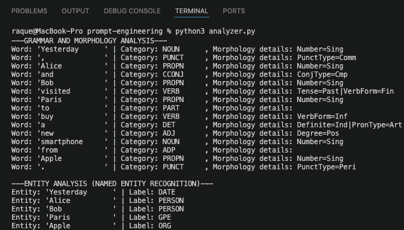
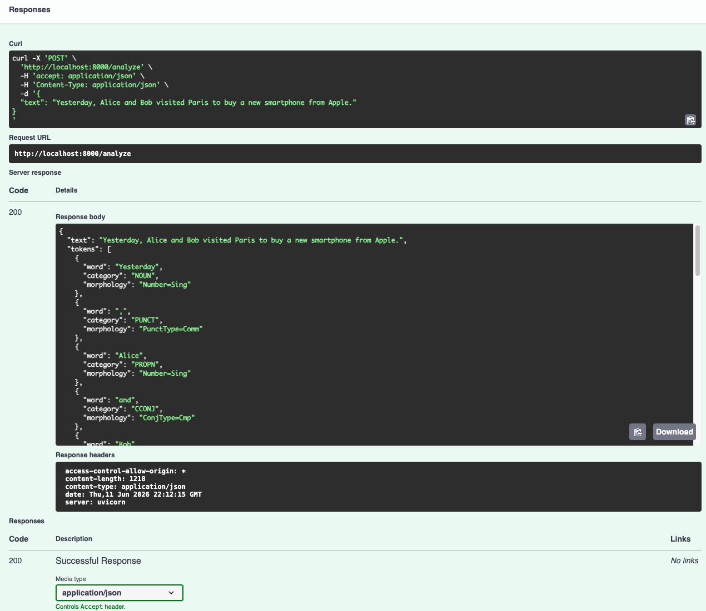

# PROMPT ENGINEERING 

In this project I am seeking to learn and practice about computational linguistics.

## 1. Environment and libraries
- spaCy
```powershell
python3 -m pip install spacy
```
- English linguistic model
```powershell
python3 -m pip install click && python3 -m spacy download en_core_web_sm
````

## 2. Linguistic Analysis Script
Creation of the [analyzer script](analyzer.py) to process text tokens, parts of speech (POS), morphology, and named entities (NER).

```python
# Execution command
python3 analyzer.py
```

### Output Result
Below is the execution output showing a full linguistic profile (including verbs, nouns, and entities like dates, people, places, and organizations):

```text
Tokens and their parts of speech:
---GRAMMAR AND MORPHOLOGY ANALYSIS---
Word: 'Yesterday      ' | Category: ADV       , Morphology details: 
Word: ',              ' | Category: PUNCT     , Morphology details: PunctType=Comm
Word: 'Alice          ' | Category: PROPN     , Morphology details: Number=Sing
Word: 'and            ' | Category: CCONJ     , Morphology details: 
Word: 'Bob            ' | Category: PROPN     , Morphology details: Number=Sing
Word: 'visited        ' | Category: VERB      , Morphology details: Tense=Past|VerbForm=Fin
Word: 'Paris          ' | Category: PROPN     , Morphology details: Number=Sing
Word: 'to             ' | Category: PART      , Morphology details: 
Word: 'buy            ' | Category: VERB      , Morphology details: VerbForm=Inf
Word: 'a              ' | Category: DET       , Morphology details: Definite=Ind|PronType=Art
Word: 'new            ' | Category: ADJ       , Morphology details: Degree=Pos
Word: 'smartphone     ' | Category: NOUN      , Morphology details: Number=Sing
Word: 'from           ' | Category: ADP       , Morphology details: 
Word: 'Apple          ' | Category: PROPN     , Morphology details: Number=Sing
Word: '.              ' | Category: PUNCT     , Morphology details: PunctType=Peri

---ENTITY ANALYSIS (NAMED ENTITY RECOGNITION)---
Entity: 'Yesterday      ' | Label: DATE
Entity: 'Alice          ' | Label: PERSON
Entity: 'Bob            ' | Label: PERSON
Entity: 'Paris          ' | Label: GPE
Entity: 'Apple          ' | Label: ORG
```



## 3. FastAPI Implementation
Exposing the computational linguistics engine through an HTTP REST API using FastAPI.

### Installation & Execution
```powershell
# Install dependencies
python3 -m pip install fastapi uvicorn

# Start the local server
python3 -m uvicorn main:app --reload
```

### API Interactive Documentation
Once the server is running, navigate to:
* **Interactive UI (Swagger):** [http://localhost:8000/docs](http://localhost:8000/docs)
* **Alternative Docs (ReDoc):** [http://localhost:8000/redoc](http://localhost:8000/redoc)

### Endpoint Analysis (`POST /analyze`)
The API handles automated text analysis via data payloads. Sending a direct browser URL request triggers a `405 Method Not Allowed` because it requires a `POST` method with a proper JSON body.

#### Sample Request Body
```json
{
  "text": "Yesterday, Alice and Bob visited Paris to buy a new smartphone from Apple."
}
```

#### Sample Response Body
```json
{
  "text": "Yesterday, Alice and Bob visited Paris to buy a new smartphone from Apple.",
  "tokens": [
    {
      "word": "Yesterday",
      "category": "NOUN",
      "morphology": "Number=Sing"
    },
    {
      "word": ",",
      "category": "PUNCT",
      "morphology": "PunctType=Comm"
    },
    {
      "word": "Alice",
      "category": "PROPN",
      "morphology": "Number=Sing"
    },
    {
      "word": "and",
      "category": "CCONJ",
      "morphology": "ConjType=Cmp"
    },
    {
      "word": "Bob",
      "category": "PROPN",
      "morphology": "Number=Sing"
    },
    {
      "word": "visited",
      "category": "VERB",
      "morphology": "Tense=Past|VerbForm=Fin"
    },
    {
      "word": "Paris",
      "category": "PROPN",
      "morphology": "Number=Sing"
    },
    {
      "word": "to",
      "category": "PART",
      "morphology": "None"
    },
    {
      "word": "buy",
      "category": "VERB",
      "morphology": "VerbForm=Inf"
    },
    {
      "word": "a",
      "category": "DET",
      "morphology": "Definite=Ind|PronType=Art"
    },
    {
      "word": "new",
      "category": "ADJ",
      "morphology": "Degree=Pos"
    },
    {
      "word": "smartphone",
      "category": "NOUN",
      "morphology": "Number=Sing"
    },
    {
      "word": "from",
      "category": "ADP",
      "morphology": "None"
    },
    {
      "word": "Apple",
      "category": "PROPN",
      "morphology": "Number=Sing"
    },
    {
      "word": ".",
      "category": "PUNCT",
      "morphology": "PunctType=Peri"
    }
  ],
  "entities": [
    {
      "entity": "Yesterday",
      "type": "DATE"
    },
    {
      "entity": "Alice",
      "type": "PERSON"
    },
    {
      "entity": "Bob",
      "type": "PERSON"
    },
    {
      "entity": "Paris",
      "type": "GPE"
    },
    {
      "entity": "Apple",
      "type": "ORG"
    }
  ]
}
```


